# CS7IS2: Artificial Intelligence Assignment 1
Kaiyu Chen - chenka@tcd.ie - 23330889
## Environment
This code is written in Python `3.12.0`. The code uses the `pyamaze`, `numpy`. `matplotlib` library for the GUI. The library can be installed by using the following command
```bash
pip install -r requirements.txt
```
or manually install the library by using the following command
```bash
pip install pyamaze
pip install numpy
pip install matplotlib
```

## Run the code
First, clone the repository
```bash
git clone https://github.com/cky008/MazeSolver.git
```
Then, navigate to the directory
```bash
cd MazeSolver
```

To run the code simply run the main.py file, it will display a _GUI_ where parameters can be changed.
```bash
python main.py
```

## Introduction
This is the first assignment for the module Artificial Intelligence. 
There are 5 implementations in this assignment: BFS, DFS, A*, Value Iteration, and Policy Iteration for Markov Decision Process.
You can find the code in the `main.py` file. The code will display a _GUI_ where parameters can be changed such as:
1. Maze Size
    - Predefined sizes are `5x5`, `10x10`,`20x20` , `25x25`, `50x50` and `50x100`.
    - Custom size can be set by entering the `row` and `column` value.
    - You can only set one maze size at a time. Custom maze or predefined maze.
2. Goal Location
    - The goal location can be set by entering the `row` and `column` value of the goal.
    - You can set the goal no matter if it is a pre-defined maze or a custom maze.
3. Direction of the search algorithm
    - The direction of the search algorithm can be set by selecting the `options` listed in the dropdown.
    - You can set the direction no matter if it is a pre-defined maze or a custom maze.
4. The algorithms to run together or separately by selecting the `checkboxes`
    - Search Algorithms like `BFS`, `DFS`, `A*`.
    - Markov Decision Process like `Value Iteration` and `Policy Iteration`.
    - You can also set `deterministic` for the Markov Decision Process by selecting the checkbox.
    - You can set the algorithms no matter if it is a pre-defined maze or a custom maze.
5. Show Exploring Path
    - The exploring path can be shown by selecting the `checkbox`.
    - The exploring path can be shown no matter if it is a pre-defined maze or a custom maze.
    - This is only for the graph search algorithms.
6. Running Details
   - The code will display the running details of the selected algorithms.
   - `[algo name] Path` represents the final path steps of the algorithm(include the start node and the goal node).
   - `[algo name] V` represents the searched path steps of the algorithm(include the start node and the goal node).
   - `[algo name] T` represents the time taken by the algorithm to find the final path in `ms`.
   - `[algo name] MEM` represents the peak memory used by the algorithm to find the final path in `MB`.
   - `yellow color` represents the final path of the algorithm `BFS`.
   - `cyan color`(dark green) represents the final path of the algorithm `DFS`.
   - `green color`(light green) represents the final path of the algorithm `A*`.
   - `blue color` represents the final path of the algorithm `Value Iteration`.
   - `red color` represents the final path of the algorithm `Policy Iteration`.
7. Figure
   - Heat Map of the Value Iteration and Policy Iteration will be generated when the algorithms are selected.
   - The comparison of the path, running time(ms) and memory usage(MB) of the selected algorithms will be generated when the algorithms are selected.
   - The comparison of the visited path of the selected algorithms will be generated when the graph search algorithms are selected.
   
You can find the video demonstration of the code [here(https://youtu.be/wuz-iA9G)](https://youtu.be/wuz-iA9GuFo).

## Default Values
Maze: **Custom** `50x50` maze (Random Maze)  
Goal: `(1, 1)` (Top Left)  
Search Algorithm:  `none`
Direction of the search algorithm: `NWSE ` 
The selected algorithms will run together  

## Figures
### GUI
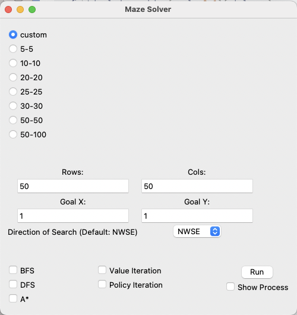
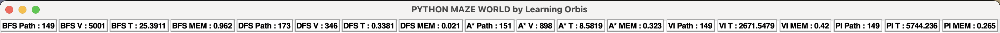
### Predefined Maze
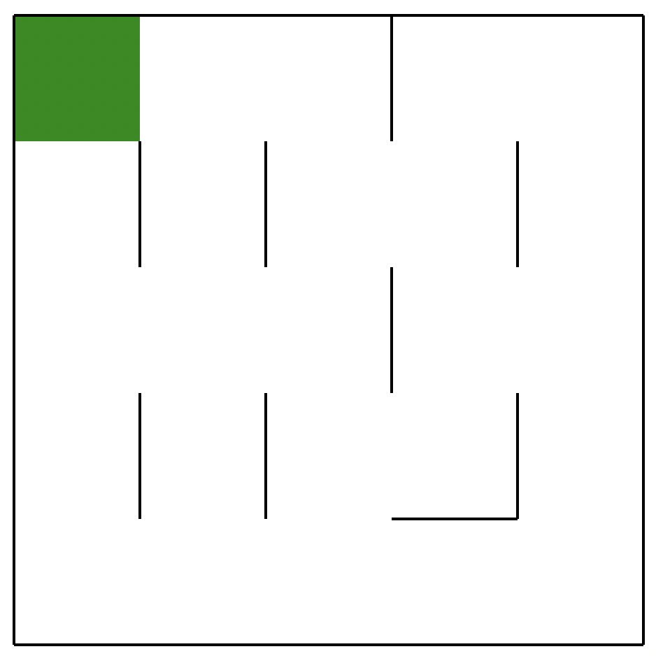
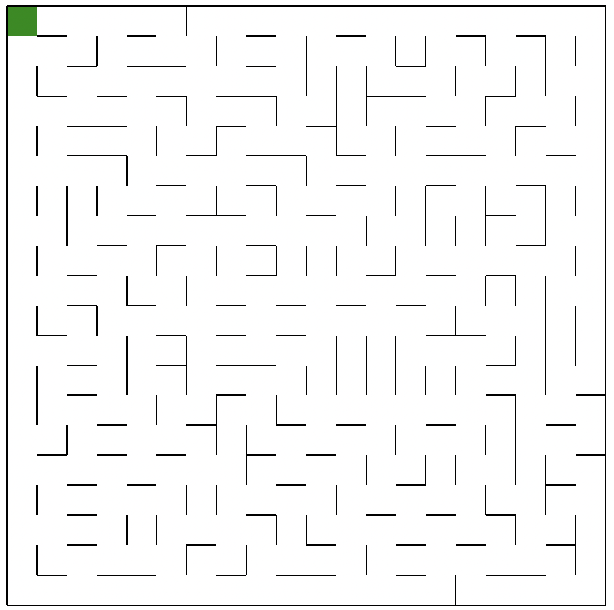
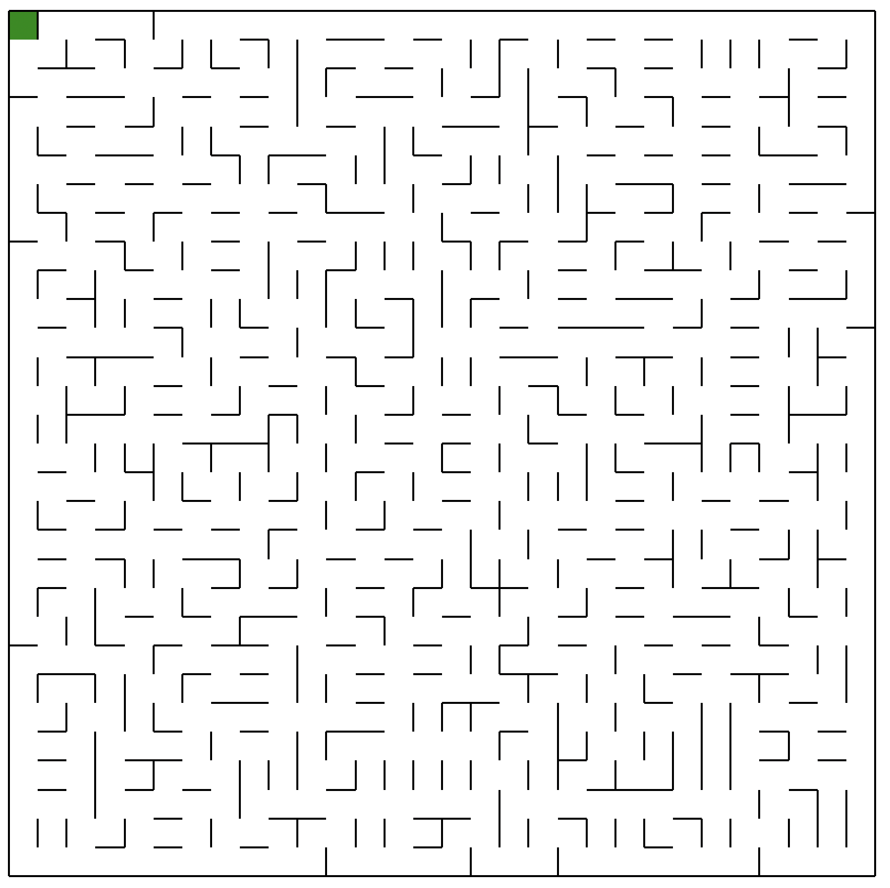
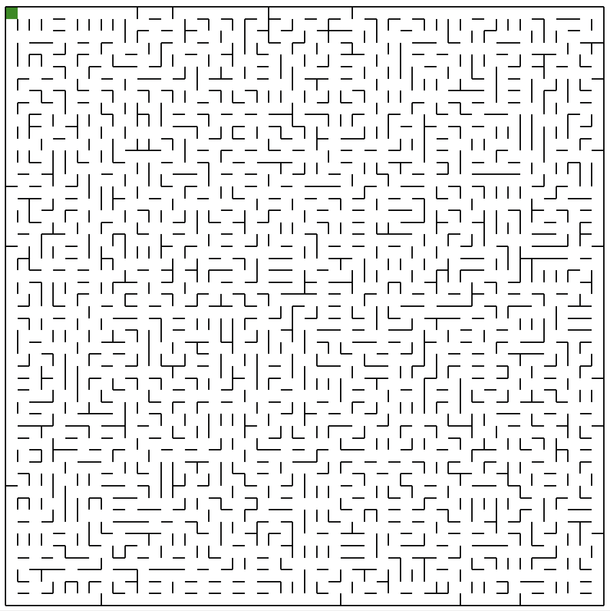
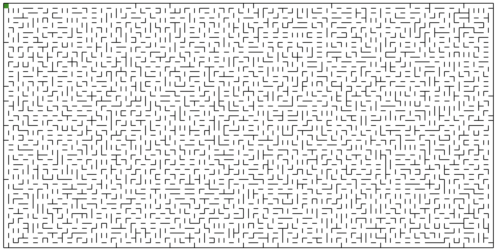
### Path
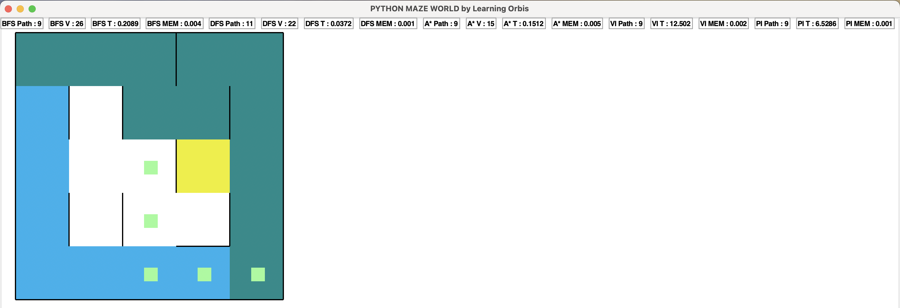
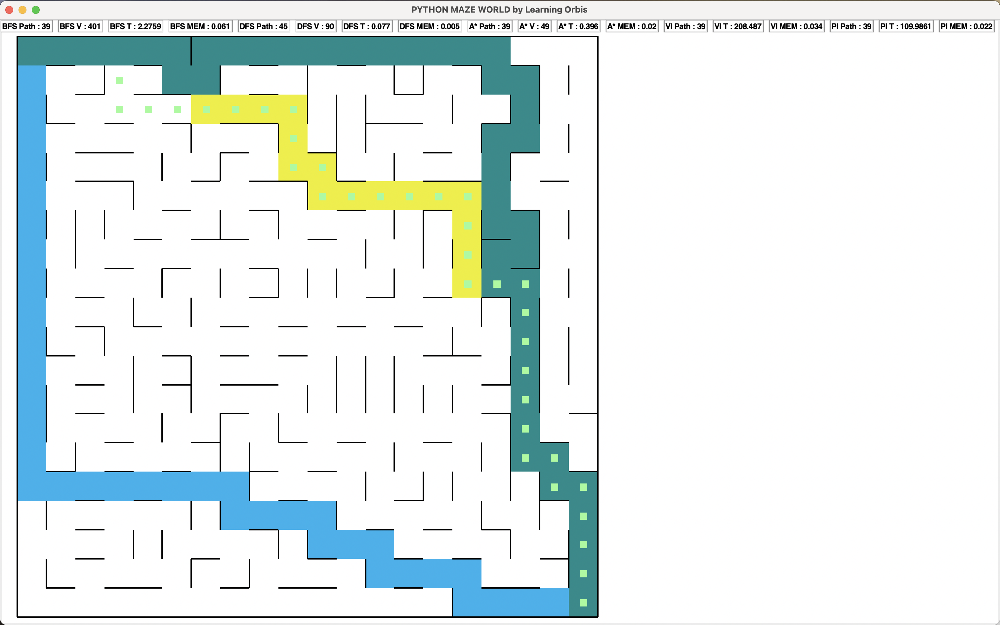
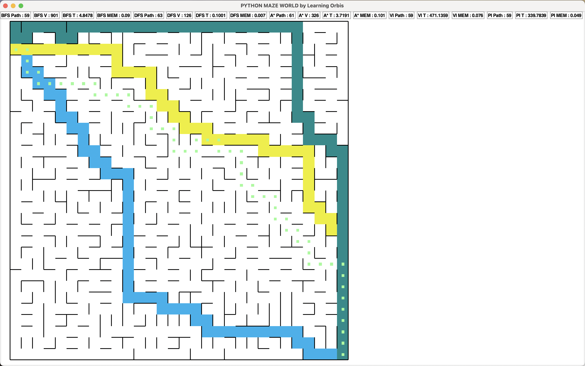
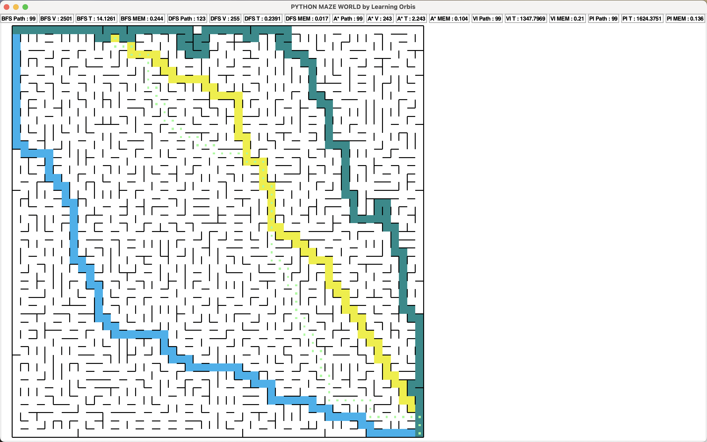
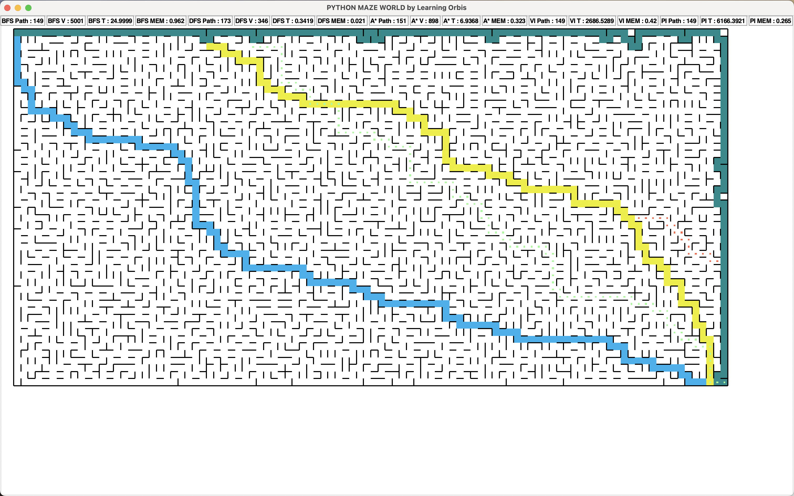
### Performance
To see the performance of the algorithms, please go to [report](report.pdf) or [report-tex](report/report.tex).
